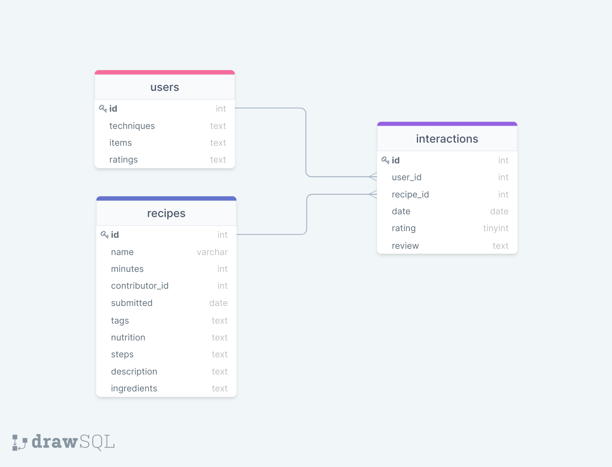
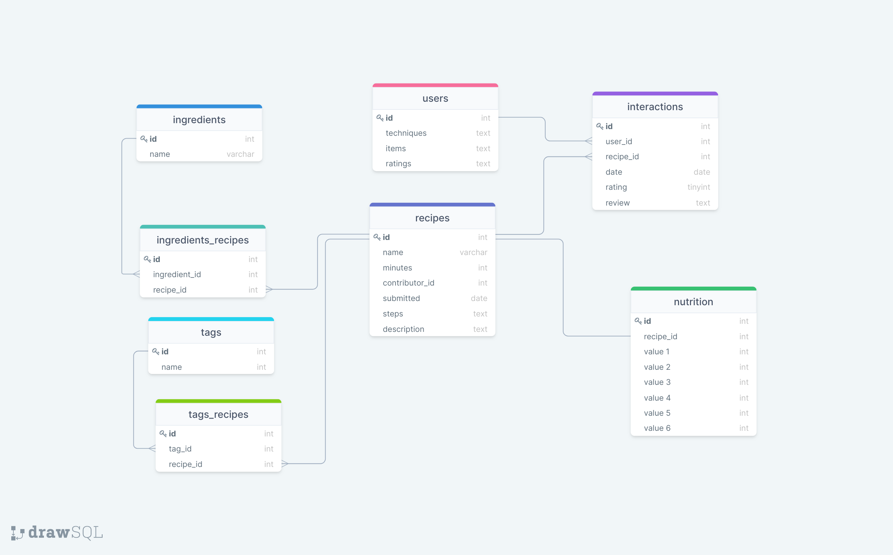

## How this project works

This ETL extracts and processes the data from csv files and then stores it in a mysql database with the following structure:

## How to run this project

- Clone this repository

  `git clone https://github.com/Jdiego06/technical-test-SM`

  `cd technical-test-SM`

- Place the csv files inside:

  `technical-test-SM/data`

- Create the database from my sql client running "create_db.sql" script.

  `mysql> source /path_to/create_db.sql`

- Modify database credentials in `config.json`

- Make sure you have the following python packages installed:

  - numpy
  - pandas
  - sqlalchemy

- Run the main script  
  `python3 main.py`

## Notes

- With some additional information, the database could be redesigned as follows:

